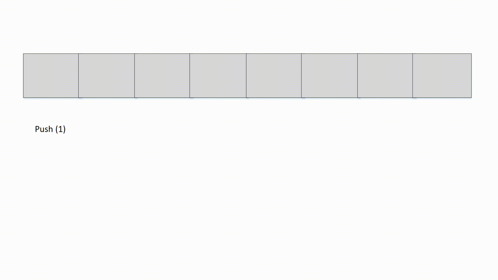

# Description 
This is a multi-threaded queue implementation without using the Queue standard library. 




## Prerequisite
For the purpose of compilation, I have added the prerequisites in the following list: 

- Cmake 3.20
- windows machine (sleep method - can be excluded) 
- MinGW64 - Google Test Library, relies on it- otherwise, the program would still work with MinGW

## Installation

As you are already on my Github page please checkout the folder with: 

```bash
git clone --recursive https://github.com/lightning1389/CPP_Coding_Challenge.git
```

## Usage
In order to build the project you just need to create the CMake environment. Navigate to the folder and open a command window within the project

```Cmake
cd CPP_Coding_Challenge        # Navigate into project folder                      
mkdir build                    # Create an empty build folder
cd build
cmake .. -DCMAKE_BUILD_TYPE=Debug -G "Unix Makefiles"
```

and to finally build the executables, please execute the following command: 

```GNU
make all
```
voilà, the executables are located in build/src and build/tst, respectively.

### Problem in Cmake build (OPTIONAL, Only in case of ERROR)

Some proxy's has a problem to recurisvely checkout the googletest lib, if you experience that problem most likely the "lib/googletest" folder is empty. 
Please navigate to lib and checkout the googletest lib: 

```bash
cd lib
git clone --recursive git@github.com:google/googletest.git
```


## Known Issues
- Test cases can be more advanced
- Implementation of a bool required for the case of lost-wakeup or sp
- Initialization of datatypes, e.g. queue<int> 0 
- The copy/move assignment and constructors only work for build in types. 
- operator== would be useful for future implementation


## Performance

Performance-wise there are many points that are worth mentioning: 

Through the circular array usage, the insertion and deletion /Push&Pop are linear: 
- Push O(1)
- Push O(1)

Nevertheless, through the usage of mutex Locks, the time can be increased.
Another point worth mentioning: 

- The interface only allows copies to be transferred, instead of the actual object. A good solution would be r-value reference, like: 

```CPP
  void push(T&& element)
```
- the mutex locks costs a lot of runtimes and probably a single-thread for each queue will be a better choice - after all a queue is a bottle-neck. 


## License
open license
